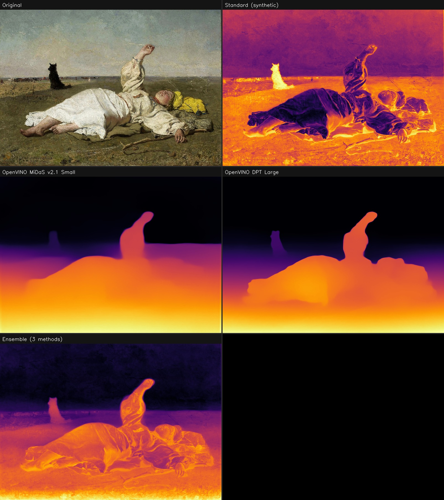

# DepthForge

> **Depth perception from 2D images — tactile 3D reproductions for the visually impaired**


*Depth map comparison for Józef Chełmoński's "Indian Summer" (Google Art Project).  
Left to right: original · Standard synthetic · OpenVINO MiDaS v2.1 Small · OpenVINO DPT Large · Ensemble (fusion of all methods)*

---

> [!IMPORTANT]
> **AI model weights are not included in the repository** (files exceed GitHub's 100 MB limit).  
> After cloning, download them with a single command:
> ```bash
> python download_models.py
> ```
> Models are hosted as assets of the [latest GitHub Release](https://github.com/GrzegorzOle/DepthForge/releases/latest) (~685 MB total).  
> Without the models the program falls back to the **synthetic method only** (no AI depth estimation).

---

## Purpose

DepthForge analyses a flat 2D image and reconstructs the **depth (spatial) information** hidden within it — estimating which parts of the scene are close and which are distant.  
The resulting depth maps serve as the foundation for creating **3D tactile reproductions** that allow visually impaired people to physically explore artworks and museum exhibits through touch.

The workflow is two-stage:

1. **DepthForge** — automated depth extraction from the image using AI models (MiDaS, DPT) accelerated by Intel OpenVINO.  
2. **3D print preparation** — the depth data is handed to a 3D printing specialist who prepares it in the correct physical form for tactile exploration.  
   This stage is led by **Jakub Oleksy**, specialist in 3D print analysis:  
   [linkedin.com/in/jakub-oleksy-672668333/](https://www.linkedin.com/in/jakub-oleksy-672668333/)

> **GIMP Plugin** — fully functional plugin for GIMP 3.2.x is included in `gimp_plugins/`.  
> Install with `python gimp_plugins/install_plugin.py` — the script auto-detects the project path  
> and writes `depthforge_install.json` to GIMP's plug-ins directory so the plugin always finds  
> the correct models, regardless of where the project is cloned.  
> Features: Visual mode (CLAHE) · Tactile mode (v9 params: fill-holes + detail-overlay + multiscale)  
> · Colour (INFERNO) or grayscale output · STL export.

---

## Requirements

- Python 3.10+
- NumPy
- OpenCV (opencv-contrib-python)
- OpenVINO
- SciPy
- numpy-stl

Optional — only needed to convert the models yourself (`convert.py`, DPT → ONNX).
The pipeline never imports these, and the CUDA wheels add ~2 GB:

```bash
pip install -e ".[convert]"   # PyTorch + transformers
```

## Installation

### For GIMP users — the standalone bundle (recommended)

If you only want the GIMP plugin, you do **not** need Python, a virtualenv, or
this repository. Download the bundle for your system from the
[Releases page](https://github.com/GrzegorzOle/DepthForge/releases/latest),
unpack it somewhere permanent, and run one command:

| Platform | Download | Install |
|---|---|---|
| Linux x86_64 (glibc 2.28+) | `DepthForge-0.1.0-linux-x86_64.tar.gz` | `./install.sh` |
| Windows 10/11 64-bit | `DepthForge-0.1.0-windows-x86_64.zip` | double-click `install.bat` |

The bundle ships its own CPython 3.12 with numpy, OpenCV, OpenVINO and SciPy
pre-installed, so it is independent of both your system Python and GIMP's
bundled one (which is a different version and cannot resolve these
dependencies). The installer copies the plugin into GIMP, points it at the
bundled interpreter, and downloads the models.

Full end-user instructions ship inside the bundle as `INSTALL_EN.md` /
`INSTALL_PL.md`, and live in the repository under `packaging/bundle_files/`.

### For developers — from source

```bash
# 1. Clone the repository
git clone https://github.com/GrzegorzOle/DepthForge.git
cd DepthForge

# 2. Create virtual environment and install dependencies
python -m venv .venv
.venv\Scripts\activate         # Windows
# source .venv/bin/activate    # Linux/macOS
pip install -r requirements.txt

# 3. Download OpenVINO models (DPT Large + MiDaS v2.1 Small, ~685 MB)
python download_models.py

# 4. Install GIMP plugin  (requires GIMP 3.2.x already installed)
python gimp_plugins/install_plugin.py

# 5. Restart GIMP
#    Plugin available at: Filters → DepthForge → Generate Depth Map…
```

> **Note:** Model weights are not stored in the repository (they exceed GitHub's 100 MB file limit).  
> They are distributed as assets attached to the [GitHub Release](https://github.com/GrzegorzOle/DepthForge/releases/latest).  
> `download_models.py` fetches them automatically.

### Manual model download (optional)

```bash
python download_models.py --model dpt      # DPT Large only
python download_models.py --model midas    # MiDaS v2.1 Small only
python download_models.py --release v0.1.0 # specific release
```

### Building the standalone bundles

Both bundles are assembled **from Linux** — the Windows one by fetching
`win_amd64` wheels via `pip --platform`, not by running a Windows interpreter:

```bash
python packaging/build_bundle.py                 # both platforms → dist/
python packaging/build_bundle.py --target linux
python packaging/build_bundle.py --with-models   # embed the models (~686 MB)
```

The Linux build verifies itself by running the real tactile pipeline through
the bundled interpreter; the Windows build cannot be executed on Linux and is
therefore unverified by construction.

---

## Usage

### Visual pipeline — depth maps + STL

```bash
python src/depth_pipeline.py --input data/Stanczyk.jpg \
    --output-dir output/stanczyk \
    --width-mm 200 --relief-mm 12
```

### Tactile pipeline — optimised for touch (tyflographic printing)

```bash
python src/depth_pipeline.py \
    --input data/Indian_summer_-_Google_Art_Project.jpg \
    --output-dir output/indian_summer_tactile \
    --tactile \
    --tactile-multiscale \
    --tactile-fine-sigma 1.5 \
    --tactile-limb-sigma 3.0 \
    --detail-strength 0.05 \
    --detail-blur-sigma 2.5 \
    --fill-holes \
    --width-mm 200 --relief-mm 7 --mesh-px 200
```

### Batch processing

```bash
python src/depth_forge.py --batch --input-dir data/ --output-dir output/
```

### Benchmark (all methods + ensemble)

```bash
python benchmark.py
```

---

## Pipeline overview

```
Input image
    │
    ├─► Standard synthetic depth map
    ├─► OpenVINO MiDaS v2.1 Small
    └─► OpenVINO DPT Large
            │
            ▼
    Scale-shift ensemble fusion  (DPT×0.50 + MiDaS×0.35 + Standard×0.15)
    Self-guided edge-preserving filter
            │
            ├─[--fill-holes]──► fill_small_object_holes()
            │                   Patches flat interiors of small objects (animals,
            │                   distant figures) undetected by depth models
            │
    ┌───────┴──────────────────────────────────────┐
    │  VISUAL mode (default)   TACTILE mode (--tactile)          │
    │                                              │
    │  apply_detail_overlay()  [--detail-strength > 0]           │
    │  Injects micro-texture   apply_detail_overlay() BEFORE     │
    │  from image luminance    smoothing — recovers limb contours │
    │                          from luminance shadow bands        │
    │                                              │
    │  postprocess_depth()     prepare_for_touch() or            │
    │  CLAHE + mild Gaussian   prepare_for_touch_multiscale()    │
    │                          Removes fine texture noise while  │
    │                          preserving limb-scale contours    │
    │                                              │
    │                          [--tactile-levels > 1]            │
    │                          quantize_depth_foreground_aware() │
    │                          Asymmetric quantization:          │
    │                          bg_levels for sky/ground,         │
    │                          fg_levels for the main figure     │
    │                                              │
    │                          smooth_quantized_boundaries()     │
    │                          Morphological closing/opening on  │
    │                          integer level masks — eliminates  │
    │                          staircase noise at level borders  │
    └──────────────────────────────────────────────┘
            │
            ▼
    depth_to_stl()  →  binary STL (watertight, Prusa-ready)
```

---

## Tactile mode — complete parameter reference

Tactile mode (`--tactile`) is designed for 3D prints that will be **read by touch**, following museum tyflographic guidelines (RNIB, Museo del Prado standards).

### Smoothing

| Flag | Default | Description |
|---|---|---|
| `--tactile-median` | `5` | Median filter footprint [px] — removes isolated spike outliers before Gaussian |
| `--tactile-sigma` | `3.5` | Gaussian σ [px] for single-pass smoothing (used when `--tactile-multiscale` is off) |
| `--tactile-multiscale` | off | **Multi-scale smoothing** — separate removal of fine texture (clothing, grass) and preservation of limb-scale contours (legs, arms, hands) |
| `--tactile-fine-sigma` | `1.5` | σ [px] for fine-texture removal in multiscale mode (1.2–1.5 recommended) |
| `--tactile-limb-sigma` | `3.0` | σ [px] defining limb scale; final filter uses `limb_sigma × 0.5` to avoid merging adjacent legs/arms (2.5–3.5 recommended) |

### Detail overlay in tactile mode

In tactile mode, `--detail-strength > 0` applies `apply_detail_overlay()` **before** the smoothing step.  
This recovers limb contours (leg separation, arm direction) from image luminance — information that DPT/MiDaS often miss in heavily draped figures.  
The subsequent smoothing then removes sharp spikes while keeping the broader contour bands.

| Flag | Default | Description |
|---|---|---|
| `--detail-strength` | `0.15` | Overlay amplitude (0 = disabled). Use `0.05–0.08` in tactile mode |
| `--detail-blur-sigma` | `1.2` | Low-pass cutoff [px] for detail extraction. Use `2.5` in tactile mode to extract broader shadow bands instead of fine spikes |

### Foreground-aware quantization

| Flag | Default | Description |
|---|---|---|
| `--tactile-levels` | `0` | Enable discrete height levels (set > 1). Total levels = `--tactile-bg-levels` + `--tactile-fg-levels` |
| `--tactile-fg-threshold` | `40.0` | Percentile splitting background from foreground |
| `--tactile-bg-levels` | `2` | Discrete levels for background zone (sky, ground) |
| `--tactile-fg-levels` | `4` | Discrete levels for foreground/figure zone |
| `--tactile-boundary-kernel` | `9` | Morphological kernel [px] for boundary smoothing. Set `0` to disable |

### Small-object hole filling

| Flag | Default | Description |
|---|---|---|
| `--fill-holes` | off | Enable after fusion; patches flat interiors of small objects (animals, distant figures) |
| `--fill-holes-min-area` | `20` | Minimum contour area [px²] |
| `--fill-holes-max-area` | `2000` | Maximum contour area [px²] — tune to the approximate pixel area of the target object |
| `--fill-holes-kernel` | `5` | Morphological kernel for contour closing |

### STL output

| Flag | Default | Description |
|---|---|---|
| `--width-mm` | `200` | Physical width of the printed model [mm] |
| `--relief-mm` | `10` (`7` with `--tactile`) | Maximum relief height above the base plate [mm] |
| `--base-mm` | `3` | Base plate thickness [mm] |
| `--mesh-px` | `512` (`140` with `--tactile`) | Maximum STL mesh resolution [px]. Use 200–256 for tactile to preserve limb geometry |

---

## Recommended tactile presets

### Continuous gradient (best starting point)

```bash
python src/depth_pipeline.py --input image.jpg --output-dir output/tactile \
    --tactile --tactile-multiscale \
    --tactile-fine-sigma 1.5 --tactile-limb-sigma 3.0 \
    --detail-strength 0.05 --detail-blur-sigma 2.5 \
    --fill-holes \
    --width-mm 200 --relief-mm 7 --mesh-px 200
```

### Museum step-relief (6 discrete levels, foreground-aware)

```bash
python src/depth_pipeline.py --input image.jpg --output-dir output/tactile_stepped \
    --tactile --tactile-multiscale \
    --tactile-fine-sigma 1.5 --tactile-limb-sigma 3.0 \
    --tactile-levels 6 --tactile-bg-levels 2 --tactile-fg-levels 4 \
    --tactile-fg-threshold 40 --tactile-boundary-kernel 9 \
    --width-mm 200 --relief-mm 7 --mesh-px 200
```

---

## Project structure

```
DepthForge/
├── assets/                  # Static assets (preview images etc.)
├── config.json              # Project configuration
├── requirements.txt         # Required libraries
├── benchmark.py             # Benchmark – all methods + ensemble
├── src/
│   ├── depth_forge.py       # Core depth map generation (DepthForge class)
│   ├── depth_pipeline.py    # Full pipeline: depth → ensemble → tactile → STL
│   │     Key functions:
│   │       normalize_f32_robust()             percentile-based normalisation
│   │       fuse_depth_maps()                  scale-shift ensemble fusion
│   │       apply_detail_overlay()             micro-detail from image luminance
│   │       fill_small_object_holes()          patches flat object interiors
│   │       prepare_for_touch()                single-pass tactile smoothing
│   │       prepare_for_touch_multiscale()     multi-scale tactile smoothing
│   │       quantize_depth()                   equal-area level quantization
│   │       quantize_depth_foreground_aware()  asymmetric fg/bg quantization
│   │       smooth_quantized_boundaries()      morphological boundary cleanup
│   │       depth_to_stl()                     watertight STL export
│   │       run_pipeline()                     full pipeline orchestrator
│   │       run_pipeline_tactile()             tactile-safe wrapper
├── gimp_plugins/
│   ├── depthforge/          # GIMP 3.x plugin (the folder GIMP loads)
│   └── install_plugin.py    # Plugin installer
├── data/                    # Input images
├── models/
│   ├── midas/openvino/      # MiDaS v2.1 Small (OpenVINO IR)
│   └── dpt/openvino/        # DPT Large (OpenVINO IR)
└── output/                  # Generated depth maps and STL files
```

---

## Configuration

`config.json` controls model paths and basic processing settings:

```json
{
  "model": {
    "depth_estimation": {
      "midas_model_path": "models/midas/openvino/midas_v21_small_256.xml",
      "dpt_model_path":   "models/dpt/openvino/dpt_large.xml"
    }
  }
}
```

---

## Tactile pipeline design notes

The tactile pipeline follows museum tyflographic guidelines (RNIB, Museo del Prado):

- **3–5 clearly distinct height levels** are preferred over continuous gradients for fingertip reading
- **Staircase noise** at level boundaries is eliminated by morphological closing/opening applied to integer-indexed level masks — not float values, which suffer from rounding errors that create hundreds of micro-regions instead of a few clean zones
- **Multi-scale smoothing** separates fine texture noise (~1–2 px, clothing folds, grass blades) from meaningful limb-scale geometry (~10–30 px, leg separation, arm contours) without a single blunt Gaussian radius that would erase both indiscriminately
- **Foreground-aware quantization** prevents the large background (sky, ground) from consuming most of the available levels at the expense of the main figure — background gets 2 levels, figure gets 4
- **Detail overlay before smoothing** recovers limb contour information from image luminance (which DPT/MiDaS miss in heavily draped figures), then the subsequent smoothing removes the sharp spikes while keeping the broader shadow bands that encode limb positions
